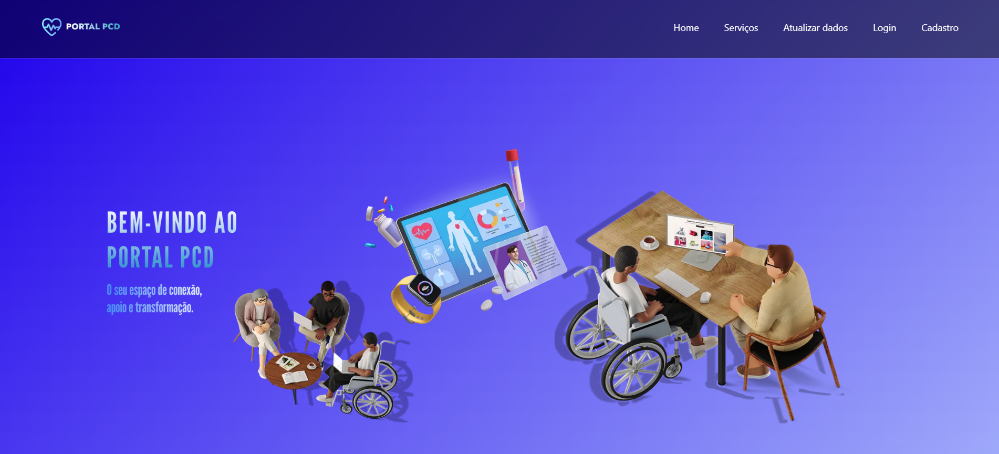

# ♿ Portal PCD

Projeto desenvolvido por uma equipe de 3 integrantes com o objetivo de criar um portal informativo e acessível voltado para Pessoas com Deficiência (PCDs), utilizando tecnologias modernas e práticas de desenvolvimento seguras e acessíveis.

---

---

## 🎯 Objetivo Geral

Desenvolver um sistema web completo, acessível e responsivo utilizando **Next.js 15.3+**, **TypeScript** e **TailwindCSS**, com foco na inclusão digital. O sistema simula um ambiente com **autenticação via cookies** e **armazenamento de dados em LocalStorage**, garantindo navegação segura e controlada para usuários autenticados.

---

## 🧠 Descrição do Projeto

O **Portal PCD** oferece conteúdos úteis para o público com deficiência, abordando temas como saúde, mobilidade, educação inclusiva, direitos, benefícios sociais e apoio psicológico.

Todas as páginas exigem login com exceção das rotas de **login** e **cadastro**. Após o login, o usuário tem acesso total à plataforma e aos recursos oferecidos.

---

## 🚀 Tecnologias Utilizadas

- Next.js 15.3+
- TypeScript
- TailwindCSS
- Autenticação com cookies
- Armazenamento via LocalStorage
- Roteamento protegido
- Componentes client/server

---

## 🗂️ Rotas do Sistema

| Rota         | Descrição                                               |
|--------------|---------------------------------------------------------|
| `/login`     | Página de login (acesso público)                        |
| `/cad-user`  | Página de cadastro de usuário (acesso público)          |
| `/home`      | Página inicial autenticada                              |
| `/listagem`  | Lista de serviços voltados para o público PCD           |
| `/update`    | Página de edição/atualização de dados via LocalStorage  |

---

## 👥 Integrantes

| Nome                  | GitHub                                              |
|-----------------------|--------------------------------------------------   |
| Gabriel Rossi         | [acessar perfil](https://github.com/GabrielRossi01) |
| Rodrigo Yamasaki      | [acessar perfil](https://github.com/RodrygoYamasaki)|
| Patrick Castro        | [acessar perfil](https://github.com/castropatrick)  |


---

## 🧐 Como executar o projeto?

### Instalação

1. Clone o repositório:

```bash
https://github.com/GabrielRossi01/portal-pcd.git
```

2. Acesse a pasta do projeto
```bash
cd portal-pcd
```

3. Instale as dependências
```bash
npm i
```

4. Rode o servidor de desenvolvimento
```bash
npm run dev
```

5. Acesse em:
```bash
http://localhost:3000
```
